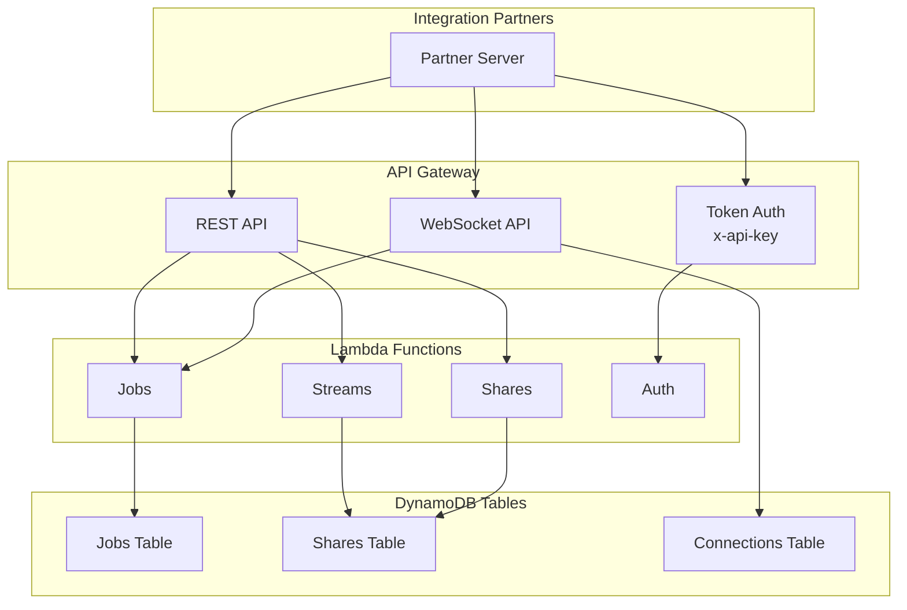

# API Overview and Integration Standards

The IDI Integration API implements a hybrid approach common in B2B SaaS integrations, distinguishing between asynchronous real-time event distribution and synchronous management commands.

## Architecture

## Protocol Overview

| API Function | Protocol | Standard Model | Rationale |
|:-------------|:---------|:---------------|:----------|
| Mission Request (CreateJob) | HTTPS (REST) | Synchronous Command Creation | Actuator Command; creates an asynchronous task |
| Track Job / Resource / Share | MQTTS & WSS | Asynchronous Data Streaming (1 Hz) | Secure transport for dynamic data and status |
| STREAM_SHARE / GET RESOURCES | HTTPS (REST) | Synchronous Access/Management | Resource discovery and credential management |

## Base URLs

| Environment | REST Base URL | MQTTS Broker | WSS Base URL |
|:------------|:--------------|:-------------|:-------------|
| Your Environment | `{{baseUrl}}` | `{{mqttBroker}}` | `{{wsUrl}}` |

> **Note:** Environment-specific URLs will be provided during partner onboarding.
