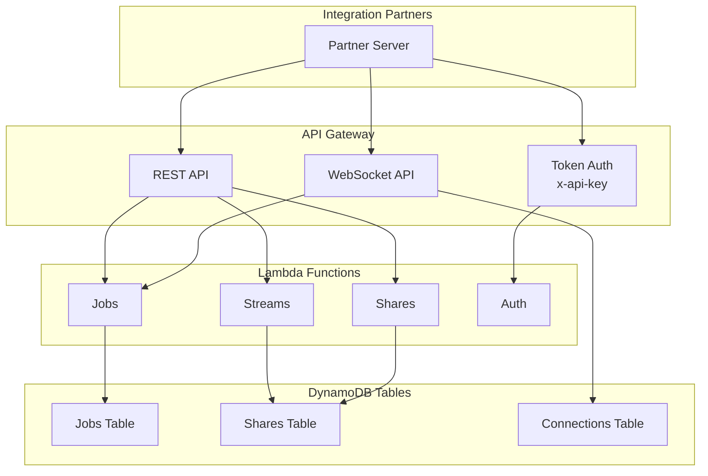

# API Overview and Integration Standards

The IDI Integration API implements a hybrid approach common in B2B SaaS integrations, distinguishing between asynchronous real-time event distribution and synchronous management commands.

## Architecture



## Protocol Overview

| API Function | Protocol | Standard Model | Rationale |
|:-------------|:---------|:---------------|:----------|
| Mission Request (CreateJob) | HTTPS (REST) | Synchronous Command Creation | Actuator Command; creates an asynchronous task |
| Track Job / Resource / Share | MQTTS & WSS | Asynchronous Data Streaming (1 Hz) | Secure transport for dynamic data and status |
| STREAM_SHARE / GET RESOURCES | HTTPS (REST) | Synchronous Access/Management | Resource discovery and credential management |

## Base URLs

| Type | Production URL |
|:-----|:---------------|
| **REST API** | `https://9v3tf7g6dj.execute-api.eu-west-2.amazonaws.com/prod` |
| **WebSocket** | `wss://qt00j5r1s7.execute-api.eu-west-2.amazonaws.com/prod` |

## WebSocket Connection Format

Connect to WebSocket with token and resource ID as query parameters:

```
{{wsUrl}}/prod?token=<JWT_TOKEN>&resourceId=<RESOURCE_ID>
```

| Parameter | Description |
|:----------|:------------|
| `token` | Your JWT access token |
| `resourceId` | The device or job ID to subscribe to |
