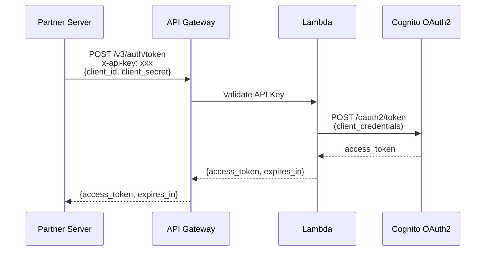

# Security and Access Control

All API interactions must adhere to stringent security protocols.

## OAuth 2.0 M2M Authentication

This API uses the OAuth 2.0 `client_credentials` grant type, designed for server-to-server (machine-to-machine) authentication with no user involvement.

Each integration partner receives credentials during onboarding:
- `client_id` - Your App Client ID
- `client_secret` - Your App Client Secret
- `x-api-key` - API Key for token endpoint access
- Pre-configured scopes defining your access level

### Authentication Flow



### Getting an Access Token

```bash
curl -X POST {{baseUrl}}/v3/auth/token \
  -H "x-api-key: {{apiKey}}" \
  -H "Content-Type: application/json" \
  -d '{
    "grant_type": "client_credentials",
    "client_id": "{{clientId}}",
    "client_secret": "{{clientSecret}}"
  }'
```

**Response:**
```json
{
  "access_token": "eyJraWQiOiJEaWVoK0U0...",
  "token_type": "Bearer",
  "expires_in": 3600
}
```

> **Note:** Scopes/permissions are pre-configured for each partner. You don't need to request specific scopes - your access level is determined by your App Client configuration.

### Token Expiration and Renewal

Tokens expire after **1 hour** (3600 seconds). The `client_credentials` grant does NOT return refresh tokens. Simply request a new token when the current one expires - this is standard for M2M authentication.

## Using the Access Token

Authentication is mandatory for all REST endpoints and real-time connections.

### REST (HTTPS)

```http
Authorization: Bearer <token>
```

**Example:**
```bash
curl -X GET {{baseUrl}}/v3/jobs \
  -H "Authorization: Bearer {{accessToken}}"
```

### MQTTS

```
Username: {{clientId}}
Password: {{accessToken}}
```

### WSS

```
{{wsUrl}}/v3/jobs/{jobID}/status/ws?token={{accessToken}}
```

## Idempotency

| Requirement | Description |
|:------------|:------------|
| Key Format | UUID v4 (e.g., `550e8400-e29b-41d4-a716-446655440000`) |
| Header | `Idempotency-Key: <uuid>` |
| Scope | Keys are uniquely scoped by API version and endpoint |
| TTL | Idempotency keys expire after 24 hours |

**Example:**

```http
POST /v3/jobs/create HTTP/1.1
Host: api.idi-fly.com
Authorization: Bearer <token>
Idempotency-Key: 550e8400-e29b-41d4-a716-446655440000
Content-Type: application/json
```

## Role-Based Access Control

| Role | Description | Permissions |
|:-----|:------------|:------------|
| `VIEWER` | Read-only access | View telemetry, View status |
| `PILOT` | Operational control | All VIEWER + Control missions |
| `MANAGER` | Full administrative | All PILOT + Share streams, Manage resources |
