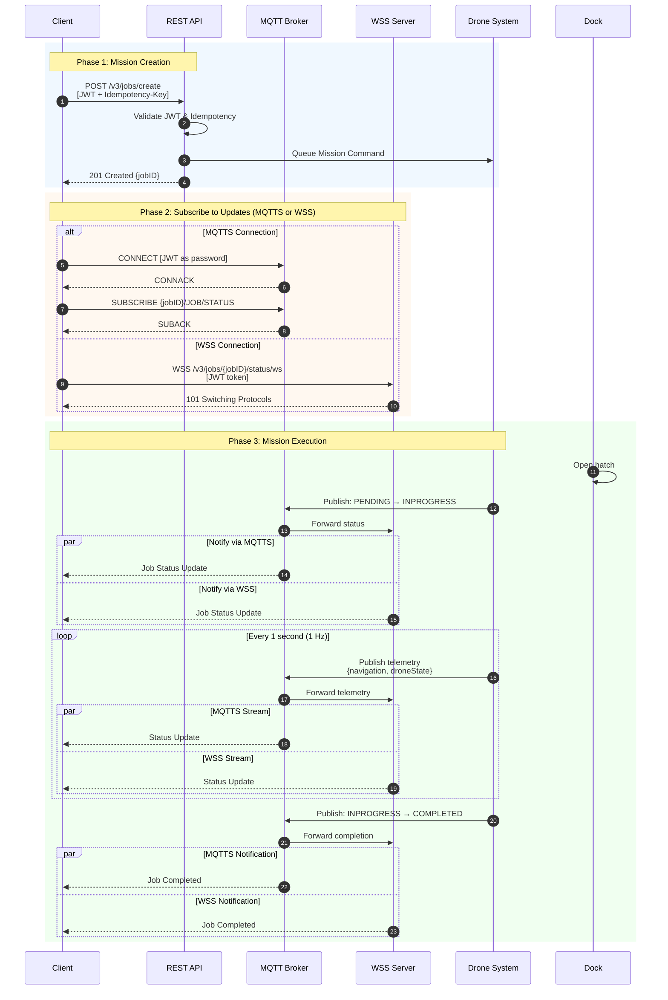
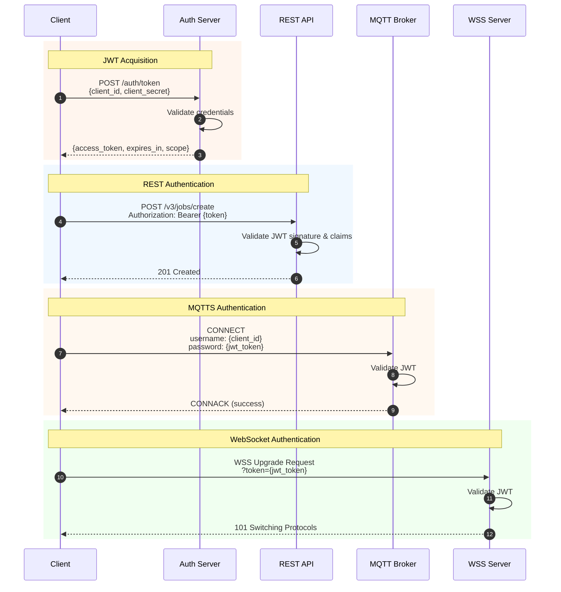
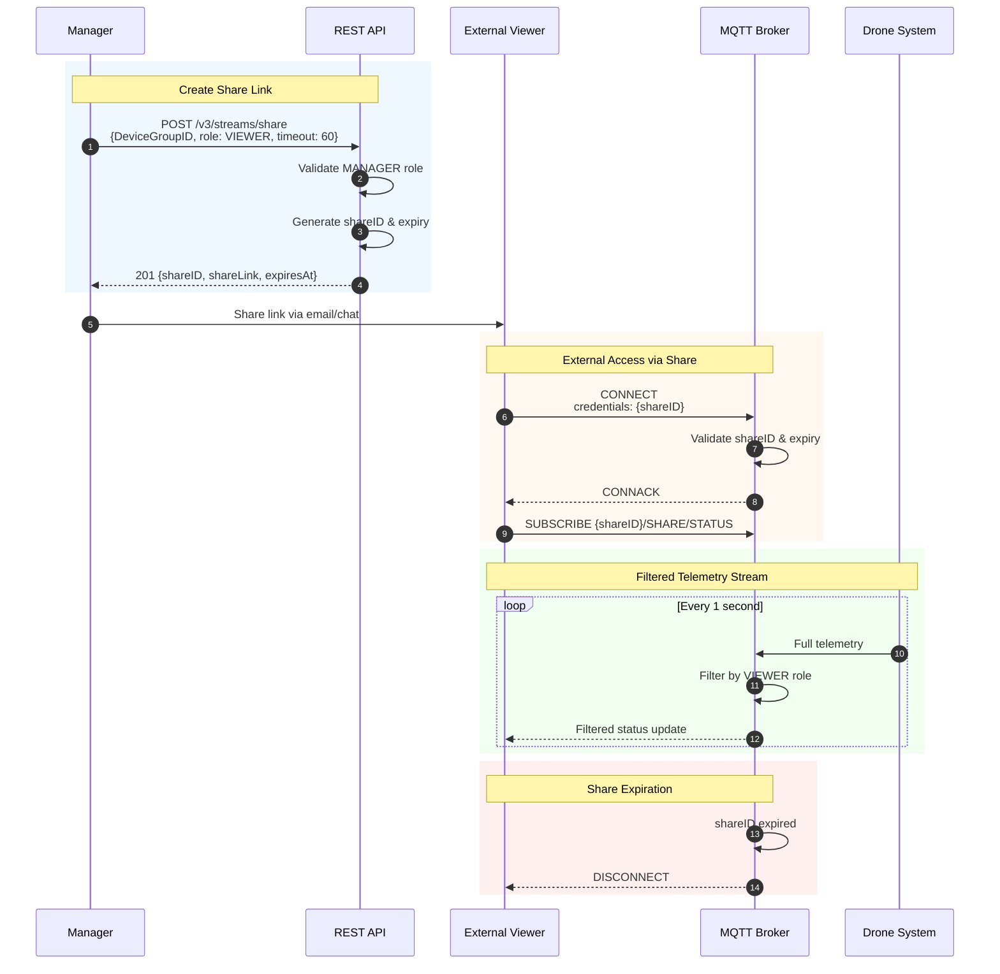
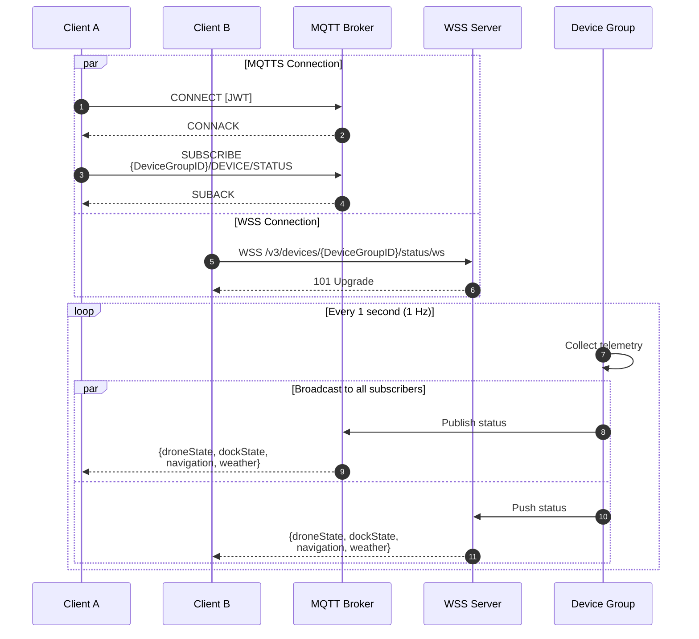
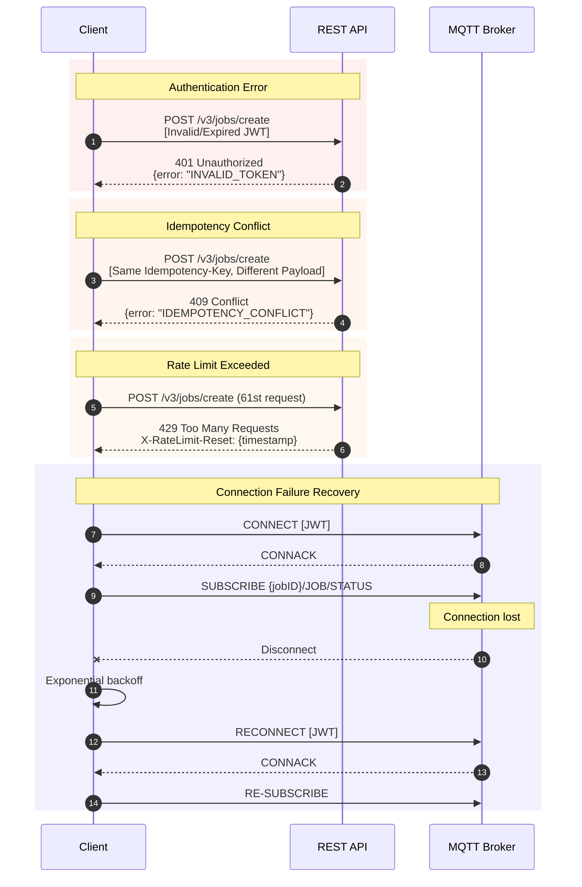
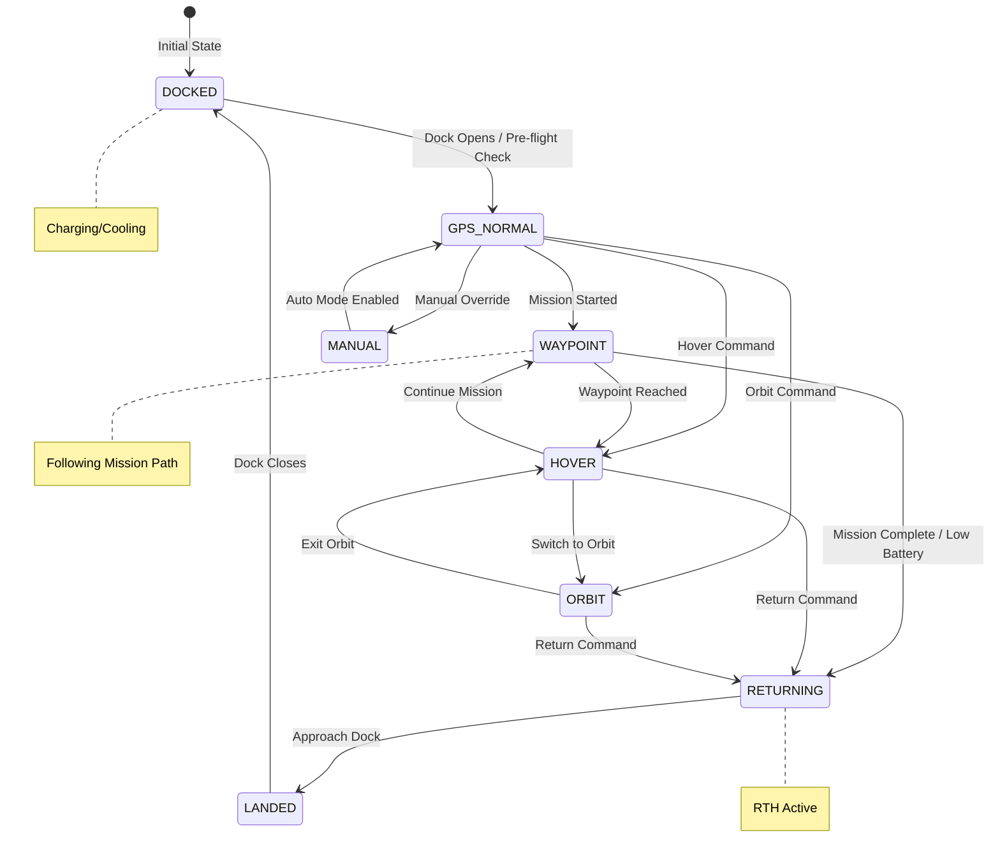
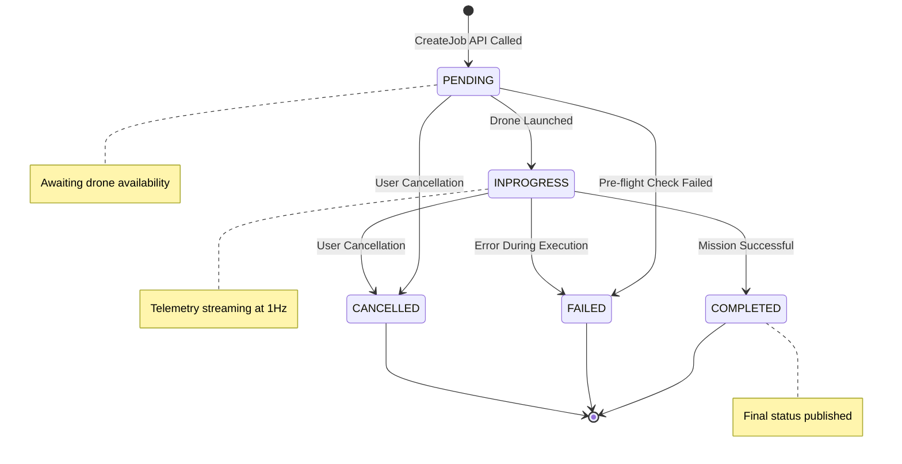
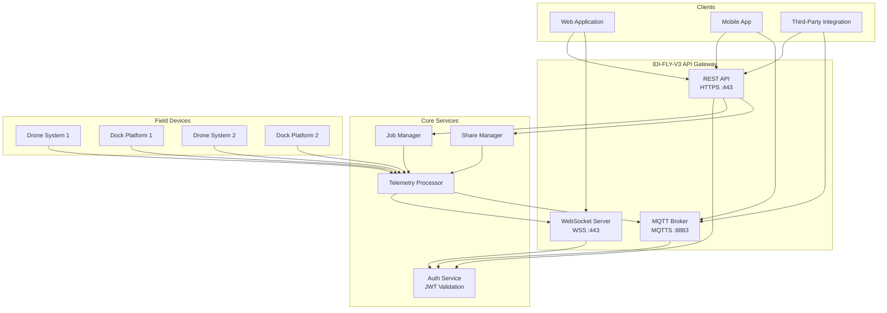

# Sequence Diagrams

Visual representations of the IDI Integration API interaction flows.

## Mission Flow

## Authentication Flow

## Stream Sharing Flow

## Resource Status Monitoring

## Error Handling Flow

## Drone State Transitions

## Job State Lifecycle

## System Architecture

