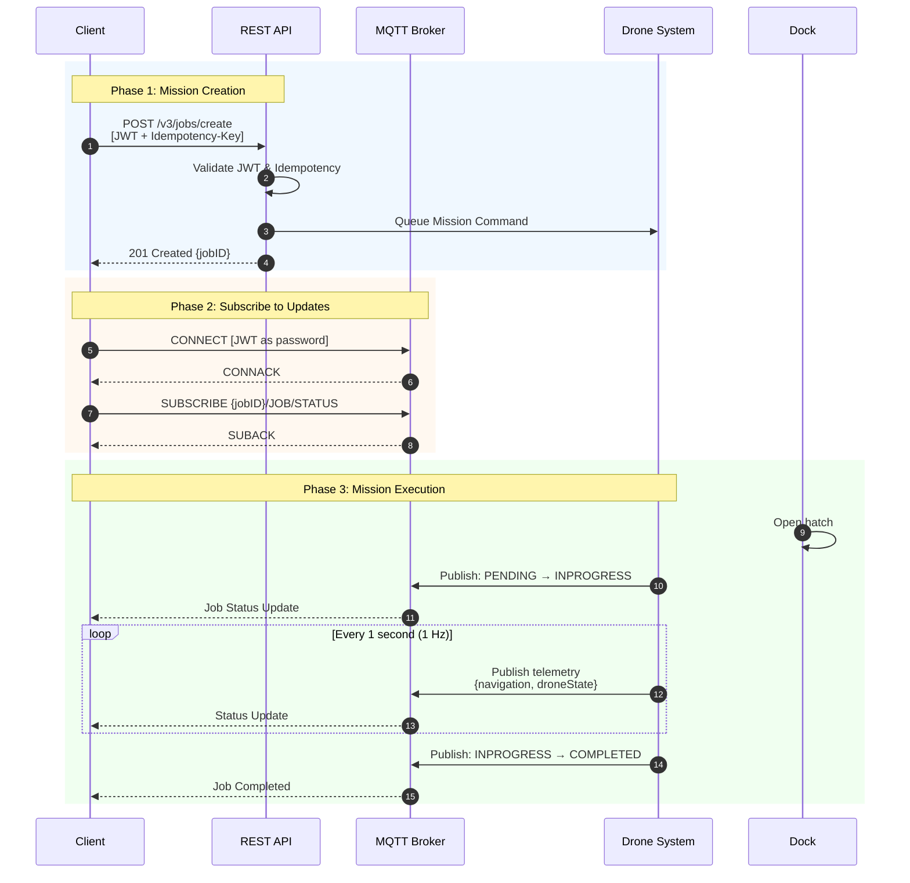
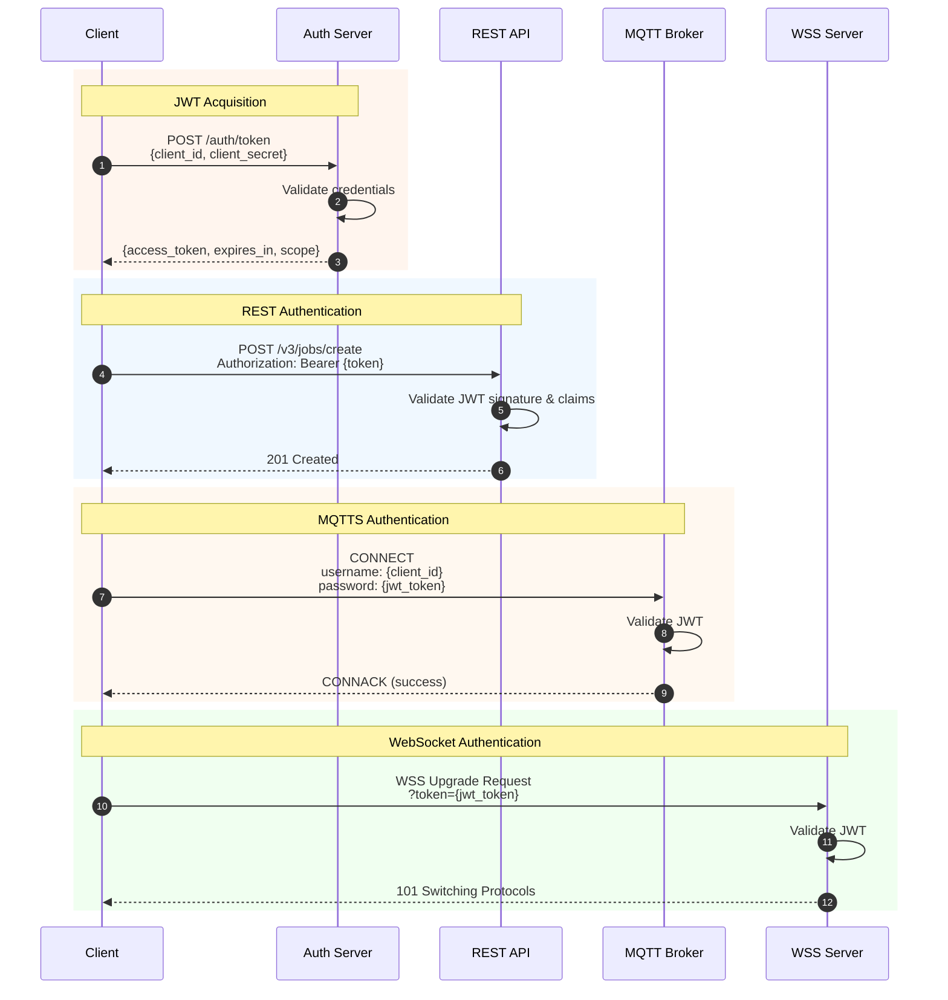
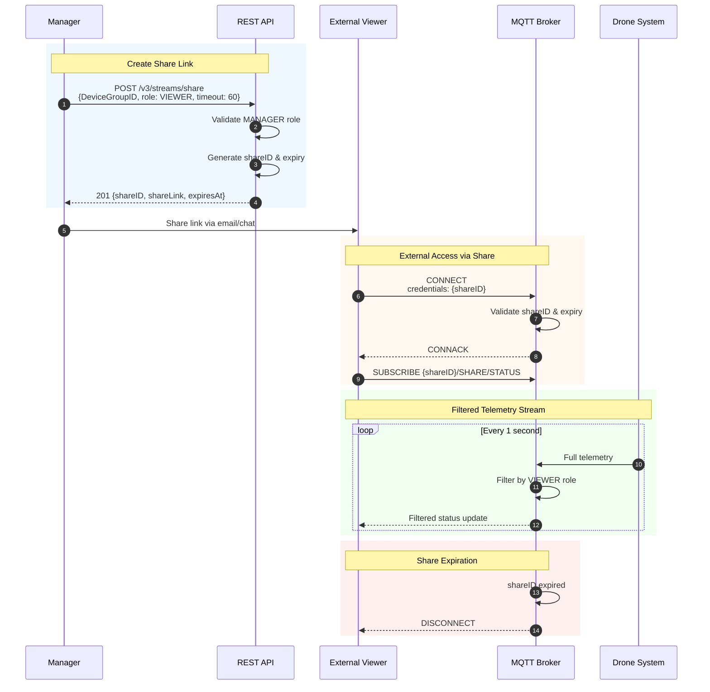
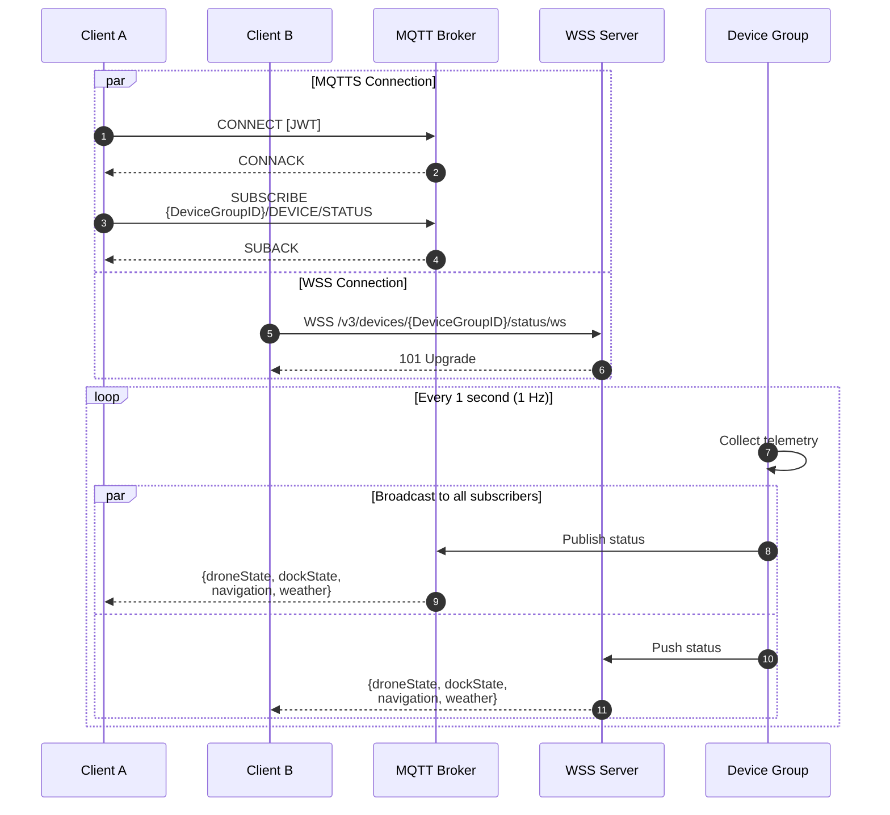
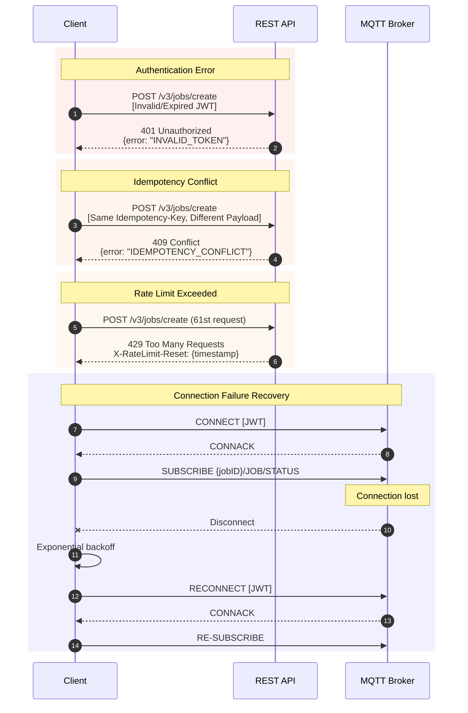
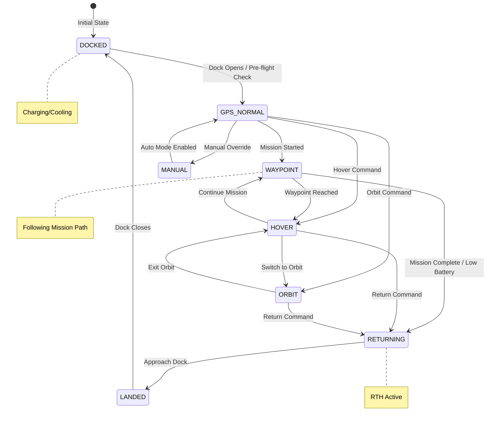
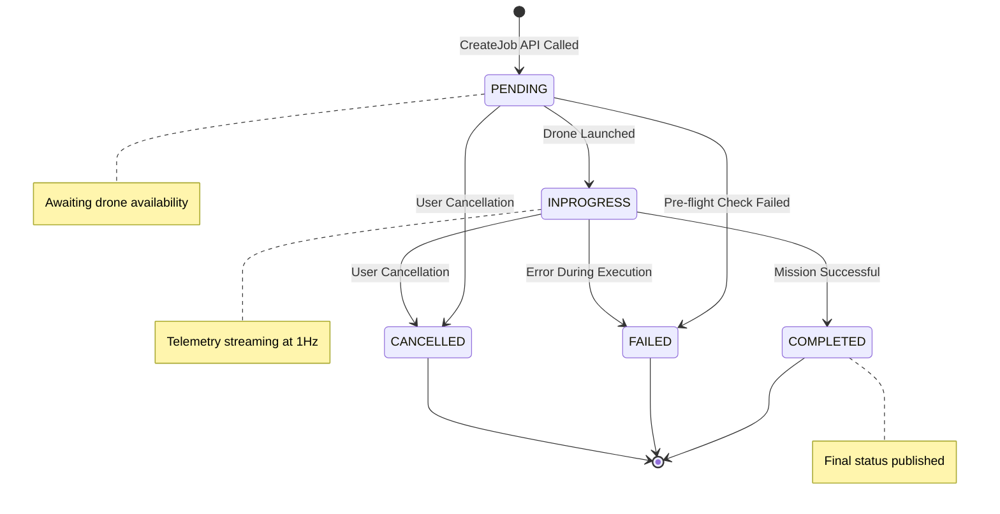
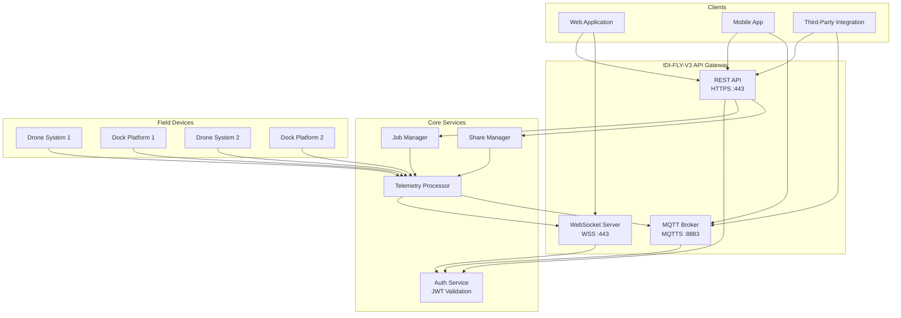

# IDI-FLY-V3 Hybrid API for Mission Telemetry

**API Version:** v3
**Last Updated:** 2025-11-27
**Status:** Production

This document details the IDI-FLY-V3 Integration API (v3), specifying the nine endpoints for mission control, resource management, and real-time telemetry, utilizing a hybrid architecture secured by HTTPS, MQTTS, and WSS.

---

## Table of Contents

1. [Sequence Diagrams](#i-sequence-diagrams)
2. [API Overview and Integration Standards](#ii-api-overview-and-integration-standards)
3. [Security and Access Control](#iii-security-and-access-control)
4. [Versioning and Deprecation Policy](#iv-versioning-and-deprecation-policy)
5. [Endpoint Specification](#v-endpoint-specification)
   - [1. Mission Request (CreateJob)](#1-mission-request-endpoint-createjob)
   - [2. Track Job Status (MQTTS)](#2-track-job-status-mqtts)
   - [3. Track Job Status (WSS)](#3-track-job-status-wss)
   - [4. Track Resource Status (MQTTS)](#4-track-resource-status-mqtts)
   - [5. Track Resource Status (WSS)](#5-track-resource-status-wss)
   - [6. STREAM_SHARE (REST)](#6-stream_share-rest)
   - [7. Track Share Status (MQTTS)](#7-track-share-status-mqtts)
   - [8. Track Share Status (WSS)](#8-track-share-status-wss)
   - [9. GET RESOURCES](#9-get-resources)
6. [Data Models](#vi-data-models)
7. [Error Handling](#vii-error-handling)
8. [Rate Limiting](#viii-rate-limiting)
9. [Changelog](#ix-changelog)

---

## I. Sequence Diagrams

Visual representations of the API interaction flows.

### 1.1. Complete Mission Flow (CreateJob → Track → Complete)



### 1.2. Authentication Flow



### 1.3. Stream Sharing Flow



### 1.4. Resource Status Monitoring (MQTTS vs WSS)



### 1.5. Error Handling Flow



### 1.6. Drone Mission State Transitions



### 1.7. Job State Lifecycle



### 1.8. System Architecture Overview



---

## II. API Overview and Integration Standards

The IDI-FLY-V3 API implements a hybrid approach common in B2B SaaS integrations, distinguishing between asynchronous real-time event distribution and synchronous management commands.

| API Function | Protocol | Standard Model | Rationale / OGC Concept |
|:-------------|:---------|:---------------|:------------------------|
| Mission Request (CreateJob) | HTTPS (REST) | Synchronous Command Creation | Actuator Command; creates an asynchronous task/Order Item |
| Track Job / Resource / Share | MQTTS (Pub/Sub) & WSS (WebSocket) | Asynchronous Data Streaming (1 Hz) | Secure transport for dynamic data (Observations) and status (Control Streams) |
| STREAM_SHARE / GET RESOURCES | HTTPS (REST) | Synchronous Access/Management | Resource discovery and temporary credential management |

### Base URLs

| Environment | REST Base URL | MQTTS Broker | WSS Base URL |
|:------------|:--------------|:-------------|:-------------|
| Production  | `https://api.idi-fly.com/v3` | `mqtts://mqtt.idi-fly.com:8883` | `wss://ws.idi-fly.com/v3` |
| Staging     | `https://api-staging.idi-fly.com/v3` | `mqtts://mqtt-staging.idi-fly.com:8883` | `wss://ws-staging.idi-fly.com/v3` |

---

## III. Security and Access Control

All API interactions must adhere to stringent security protocols, aligned with modern API best practices.

### 3.1. JWT Authentication (All Endpoints)

Authentication is mandatory for all REST endpoints and real-time connections.

#### REST (HTTPS)
Clients must include a valid JSON Web Token (JWT) in the `Authorization` header using the Bearer scheme:

```http
Authorization: Bearer <token>
```

Authentication validates credentials, and authorization limits access based on the granted scopes and roles.

#### Streaming (MQTTS)
The JWT token is used as the **password** during connection establishment:

```
Username: <client_id>
Password: <jwt_token>
```

#### Streaming (WSS)
The JWT is used to authorize the secure session during the initial handshake via query parameter or header:

```
wss://ws.idi-fly.com/v3/jobs/{jobID}/status/ws?token=<jwt_token>
```

### 3.2. Idempotency (Mission Request/CreateJob)

As the CreateJob endpoint performs a non-safe operation (POST), it must employ an **Idempotency Key** mechanism to prevent duplicate processing if a client retries a request.

| Requirement | Description |
|:------------|:------------|
| Key Format | UUID v4 (e.g., `550e8400-e29b-41d4-a716-446655440000`) |
| Header | `Idempotency-Key: <uuid>` |
| Scope | Keys are uniquely scoped by API version and endpoint |
| TTL | Idempotency keys expire after 24 hours |

**Example Request:**

```http
POST /v3/jobs/create HTTP/1.1
Host: api.idi-fly.com
Authorization: Bearer <token>
Idempotency-Key: 550e8400-e29b-41d4-a716-446655440000
Content-Type: application/json
```

### 3.3. Role-Based Access Control (RBAC)

| Role | Description | Permissions |
|:-----|:------------|:------------|
| `VIEWER` | Read-only access to streams | View telemetry, View status |
| `PILOT` | Operational control | All VIEWER + Control missions |
| `MANAGER` | Full administrative access | All PILOT + Share streams, Manage resources |

---

## IV. Versioning and Deprecation Policy

The API follows robust versioning practices to maintain stable and clean integrations.

### 4.1. Versioning Standard

We use **Header-Based Versioning** utilizing custom Vendor Media Types.

Clients must specify the desired version in the `Accept` header:

```http
Accept: application/vnd.idi-fly.api-v3+json
```

### 4.2. Default and Fallback Behavior

- **Default Version:** When the `Accept` header is missing, the API defaults to the latest stable version.
- **Fallback Logic:** Unsupported versions are routed to the nearest compatible version when possible.

### 4.3. Deprecation Communication

Deprecation warnings are communicated using standard HTTP headers:

```http
Warning: 299 - "This version will be deprecated on 2025-12-31"
Sunset: Sat, 31 Dec 2025 23:59:59 GMT
```

### 4.4. Error Handling for Unsupported Versions

When an unsupported version is requested, the API returns:

```json
{
  "error": "UnsupportedMediaType",
  "message": "The requested API version is not supported",
  "supportedVersions": [
    "application/vnd.idi-fly.api-v3+json",
    "application/vnd.idi-fly.api-v2+json"
  ],
  "code": 415
}
```

---

## V. Endpoint Specification

### 1. Mission Request Endpoint (CreateJob)

Creates a new mission job for a specified device group.

| Detail | Specification |
|:-------|:--------------|
| **Method** | `POST` |
| **URI** | `/v3/jobs/create` |
| **Content-Type** | `application/json` |
| **Security** | JWT Auth, Mandatory `Idempotency-Key` header |
| **Success Response** | `201 Created` |

#### Request Body

| Field | Type | Mandatory | Description |
|:------|:-----|:----------|:------------|
| `DeviceGroupID` | UUID | Yes | The ID of the System/Resource (drone/dock) to be commanded |
| `MissionID` | UUID | Conditional | Required if `ActionOnArrival` is `MISSION` |
| `DesiredLocation` | GeoJSON Point | Conditional | Required if `ActionOnArrival` is `HOVER` or `ORBIT` |
| `ActionOnArrival` | Enum | Yes | `HOVER`, `ORBIT`, or `MISSION` |

#### Example Request

```json
{
  "DeviceGroupID": "b775cc6e-1234-5678-90ab-cdef12345678",
  "MissionID": "a1b2c3d4-5678-90ab-cdef-123456789012",
  "ActionOnArrival": "MISSION"
}
```

#### Example Request (with Location)

```json
{
  "DeviceGroupID": "b775cc6e-1234-5678-90ab-cdef12345678",
  "DesiredLocation": {
    "type": "Point",
    "coordinates": [-122.4194, 37.7749, 100]
  },
  "ActionOnArrival": "HOVER"
}
```

#### Success Response (201 Created)

```json
{
  "jobID": "job-f47ac10b-58cc-4372-a567-0e02b2c3d479",
  "status": "PENDING",
  "createdAt": "2025-11-27T10:30:00Z",
  "DeviceGroupID": "b775cc6e-1234-5678-90ab-cdef12345678",
  "_links": {
    "self": {
      "href": "/v3/jobs/job-f47ac10b-58cc-4372-a567-0e02b2c3d479"
    },
    "status_ws": {
      "href": "/v3/jobs/job-f47ac10b-58cc-4372-a567-0e02b2c3d479/status/ws"
    },
    "status_mqtt": {
      "topic": "job-f47ac10b-58cc-4372-a567-0e02b2c3d479/JOB/STATUS"
    }
  }
}
```

---

### 2. Track Job Status (MQTTS)

Real-time job status updates via MQTT over TLS.

| Detail | Specification |
|:-------|:--------------|
| **Protocol** | MQTTS |
| **Topic** | `{jobID}/JOB/STATUS` |
| **QoS** | 1 (At least once) |
| **Security** | JWT (as password) / TLS |
| **Frequency** | 1 Hz |

#### Subscription Example

```
Topic: job-f47ac10b-58cc-4372-a567-0e02b2c3d479/JOB/STATUS
```

#### Message Payload

```json
{
  "jobState": "INPROGRESS",
  "droneState": "WAYPOINT",
  "dockState": "OPEN",
  "navigation": {
    "position": {
      "type": "Point",
      "coordinates": [-122.4194, 37.7749, 85.5]
    },
    "orientation": {
      "heading": 270.5,
      "pitch": -2.1,
      "roll": 0.3
    },
    "velocity": {
      "groundSpeed": 12.5,
      "verticalSpeed": -0.5
    }
  },
  "timestamp": "2025-11-27T10:30:15.123Z"
}
```

---

### 3. Track Job Status (WSS)

Real-time job status updates via WebSocket Secure.

| Detail | Specification |
|:-------|:--------------|
| **Protocol** | WSS |
| **URI** | `/v3/jobs/{jobID}/status/ws` |
| **Security** | JWT Auth / TLS |
| **Frequency** | 1 Hz |

#### Connection Example

```javascript
const ws = new WebSocket(
  'wss://ws.idi-fly.com/v3/jobs/job-f47ac10b-58cc-4372-a567-0e02b2c3d479/status/ws',
  [],
  { headers: { 'Authorization': 'Bearer <token>' } }
);
```

#### Message Payload

Same as MQTTS (Endpoint 2).

---

### 4. Track Resource Status (MQTTS)

Continuous telemetry stream from a device group via MQTT.

| Detail | Specification |
|:-------|:--------------|
| **Protocol** | MQTTS |
| **Topic** | `{DeviceGroupID}/DEVICE/STATUS` |
| **QoS** | 1 |
| **Security** | JWT (as password) / TLS |
| **Frequency** | 1 Hz |

#### Message Payload

```json
{
  "droneState": "GPS_NORMAL",
  "dockState": "CLOSED",
  "navigation": {
    "position": {
      "type": "Point",
      "coordinates": [-122.4194, 37.7749, 0]
    },
    "orientation": {
      "heading": 0,
      "pitch": 0,
      "roll": 0
    }
  },
  "weather": {
    "windSpeed": 5.2,
    "windDirection": 180,
    "temperature": 22.5,
    "humidity": 65,
    "rain": false
  },
  "timestamp": "2025-11-27T10:30:15.123Z"
}
```

---

### 5. Track Resource Status (WSS)

Continuous telemetry stream from a device group via WebSocket.

| Detail | Specification |
|:-------|:--------------|
| **Protocol** | WSS |
| **URI** | `/v3/devices/{DeviceGroupID}/status/ws` |
| **Security** | JWT Auth / TLS |
| **Frequency** | 1 Hz |

#### Message Payload

Same as MQTTS (Endpoint 4).

---

### 6. STREAM_SHARE (REST)

Generates a limited-time credential for external access to a resource stream.

| Detail | Specification |
|:-------|:--------------|
| **Method** | `POST` |
| **URI** | `/v3/streams/share` |
| **Security** | JWT Auth (requires `MANAGER` role) |
| **Success Response** | `201 Created` |

#### Request Body

| Field | Type | Mandatory | Description |
|:------|:-----|:----------|:------------|
| `DeviceGroupID` | UUID | Yes | The resource whose data stream is being shared |
| `role` | Enum | Yes | Access level: `VIEWER`, `PILOT`, or `MANAGER` |
| `timeout` | Integer | Yes | Duration in minutes for which the share is valid |

#### Example Request

```json
{
  "DeviceGroupID": "b775cc6e-1234-5678-90ab-cdef12345678",
  "role": "VIEWER",
  "timeout": 60
}
```

#### Success Response (201 Created)

```json
{
  "shareID": "share-abc123def456",
  "shareLink": "https://app.idi-fly.com/shared/share-abc123def456",
  "expiresAt": "2025-11-27T11:30:00Z",
  "role": "VIEWER",
  "DeviceGroupID": "b775cc6e-1234-5678-90ab-cdef12345678",
  "_links": {
    "status_ws": {
      "href": "/v3/shares/share-abc123def456/status/ws"
    },
    "status_mqtt": {
      "topic": "share-abc123def456/SHARE/STATUS"
    }
  }
}
```

---

### 7. Track Share Status (MQTTS)

Real-time status updates for a shared stream session.

| Detail | Specification |
|:-------|:--------------|
| **Protocol** | MQTTS |
| **Topic** | `{shareID}/SHARE/STATUS` |
| **Authentication** | `shareID` as temporary session credential |
| **Frequency** | 1 Hz |

**Note:** Payload content is dynamically filtered according to the role defined when creating the share.

---

### 8. Track Share Status (WSS)

Real-time status updates for a shared stream session via WebSocket.

| Detail | Specification |
|:-------|:--------------|
| **Protocol** | WSS |
| **URI** | `/v3/shares/{shareID}/status/ws` |
| **Authentication** | `shareID` as temporary session credential |
| **Frequency** | 1 Hz |

---

### 9. GET RESOURCES

Retrieves the collection of Device Group IDs accessible via a share code.

| Detail | Specification |
|:-------|:--------------|
| **Method** | `GET` |
| **URI** | `/v3/shares/{sharecode}/resources` |
| **Security** | JWT Auth (mandatory) |
| **Success Response** | `200 OK` |

#### Path Parameters

| Parameter | Type | Description |
|:----------|:-----|:------------|
| `sharecode` | String | The unique ID obtained from STREAM_SHARE |

#### Success Response (200 OK)

```json
{
  "resources": [
    "drone-system-b775cc6e",
    "dock-platform-d99f01a3"
  ],
  "page": {
    "size": 10,
    "totalElements": 2,
    "totalPages": 1,
    "number": 0
  },
  "_links": {
    "self": {
      "href": "/v3/shares/{sharecode}/resources"
    }
  }
}
```

---

## VI. Data Models

### 6.1. Job States

| State | Description |
|:------|:------------|
| `PENDING` | Job created, awaiting execution |
| `INPROGRESS` | Job is actively being executed |
| `COMPLETED` | Job finished successfully |
| `FAILED` | Job encountered an error |
| `CANCELLED` | Job was cancelled by user |

### 6.2. Drone States

| State | Description |
|:------|:------------|
| `MANUAL` | Drone under manual control |
| `GPS_NORMAL` | GPS lock acquired, ready for autonomous operation |
| `WAYPOINT` | Following waypoint navigation |
| `HOVER` | Holding position in hover mode |
| `ORBIT` | Executing orbit pattern |
| `LANDED` | Drone has landed |
| `DOCKED` | Drone is docked in charging station |
| `RETURNING` | Returning to home/dock |

### 6.3. Dock States

| State | Description |
|:------|:------------|
| `OPEN` | Dock is open |
| `CLOSED` | Dock is closed |
| `OPENING` | Dock is in process of opening |
| `CLOSING` | Dock is in process of closing |
| `COOLING` | Dock is cooling the drone |
| `CHARGING` | Dock is charging the drone |
| `TASK_INPROGRESS` | Dock is performing a task |

### 6.4. GeoJSON Point (DesiredLocation)

```json
{
  "type": "Point",
  "coordinates": [longitude, latitude, altitude]
}
```

- `longitude`: Decimal degrees (-180 to 180)
- `latitude`: Decimal degrees (-90 to 90)
- `altitude`: Meters above sea level (optional)

### 6.5. GeoPose (Navigation Object)

```json
{
  "position": {
    "type": "Point",
    "coordinates": [-122.4194, 37.7749, 85.5]
  },
  "orientation": {
    "heading": 270.5,
    "pitch": -2.1,
    "roll": 0.3
  },
  "velocity": {
    "groundSpeed": 12.5,
    "verticalSpeed": -0.5
  }
}
```

### 6.6. Weather Object

```json
{
  "windSpeed": 5.2,
  "windDirection": 180,
  "temperature": 22.5,
  "humidity": 65,
  "rain": false
}
```

| Field | Type | Unit | Description |
|:------|:-----|:-----|:------------|
| `windSpeed` | Float | m/s | Wind speed |
| `windDirection` | Integer | degrees | Wind direction (0-360) |
| `temperature` | Float | °C | Ambient temperature |
| `humidity` | Integer | % | Relative humidity (0-100) |
| `rain` | Boolean | - | Rain detected |

---

## VII. Error Handling

### 7.1. Standard Error Response Format

```json
{
  "error": "ErrorCode",
  "message": "Human-readable error description",
  "code": 400,
  "details": {},
  "requestId": "req-abc123",
  "timestamp": "2025-11-27T10:30:00Z"
}
```

### 7.2. HTTP Status Codes

| Code | Meaning | Description |
|:-----|:--------|:------------|
| `200` | OK | Request succeeded |
| `201` | Created | Resource created successfully |
| `400` | Bad Request | Invalid request payload |
| `401` | Unauthorized | Missing or invalid JWT |
| `403` | Forbidden | Insufficient permissions |
| `404` | Not Found | Resource not found |
| `409` | Conflict | Duplicate idempotency key with different payload |
| `415` | Unsupported Media Type | Invalid API version requested |
| `422` | Unprocessable Entity | Validation error |
| `429` | Too Many Requests | Rate limit exceeded |
| `500` | Internal Server Error | Server error |
| `503` | Service Unavailable | Service temporarily unavailable |

### 7.3. Common Error Codes

| Error Code | HTTP Status | Description |
|:-----------|:------------|:------------|
| `INVALID_TOKEN` | 401 | JWT is invalid or expired |
| `INSUFFICIENT_PERMISSIONS` | 403 | User lacks required role |
| `DEVICE_NOT_FOUND` | 404 | DeviceGroupID does not exist |
| `JOB_NOT_FOUND` | 404 | JobID does not exist |
| `MISSION_NOT_FOUND` | 404 | MissionID does not exist |
| `IDEMPOTENCY_CONFLICT` | 409 | Same key used with different payload |
| `VALIDATION_ERROR` | 422 | Request validation failed |
| `DEVICE_OFFLINE` | 503 | Device is not currently online |

---

## VIII. Rate Limiting

### 8.1. REST Endpoints

| Endpoint | Rate Limit | Window |
|:---------|:-----------|:-------|
| `POST /v3/jobs/create` | 60 requests | per minute |
| `POST /v3/streams/share` | 30 requests | per minute |
| `GET /v3/shares/{sharecode}/resources` | 120 requests | per minute |

### 8.2. Rate Limit Headers

```http
X-RateLimit-Limit: 60
X-RateLimit-Remaining: 45
X-RateLimit-Reset: 1732700400
```

### 8.3. Streaming Connections

| Protocol | Limit |
|:---------|:------|
| MQTTS | 100 concurrent subscriptions per client |
| WSS | 50 concurrent connections per client |

---

## IX. Changelog

### v3.0.0 (2025-11-27)

- Initial v3 API release
- Hybrid architecture with HTTPS, MQTTS, and WSS
- Nine core endpoints for mission control and telemetry
- JWT-based authentication across all protocols
- Role-based access control (VIEWER, PILOT, MANAGER)
- Header-based versioning with vendor media types
- Idempotency support for mission requests

---

## Appendix A: Quick Reference

### Endpoint Summary

| # | Name | Method | Path/Topic | Protocol |
|:--|:-----|:-------|:-----------|:---------|
| 1 | CreateJob | POST | `/v3/jobs/create` | HTTPS |
| 2 | Track Job | SUB | `{jobID}/JOB/STATUS` | MQTTS |
| 3 | Track Job | CONNECT | `/v3/jobs/{jobID}/status/ws` | WSS |
| 4 | Track Resource | SUB | `{DeviceGroupID}/DEVICE/STATUS` | MQTTS |
| 5 | Track Resource | CONNECT | `/v3/devices/{DeviceGroupID}/status/ws` | WSS |
| 6 | Stream Share | POST | `/v3/streams/share` | HTTPS |
| 7 | Track Share | SUB | `{shareID}/SHARE/STATUS` | MQTTS |
| 8 | Track Share | CONNECT | `/v3/shares/{shareID}/status/ws` | WSS |
| 9 | Get Resources | GET | `/v3/shares/{sharecode}/resources` | HTTPS |

---

*Document generated for IDI-FLY-V3 API v3.0.0*
