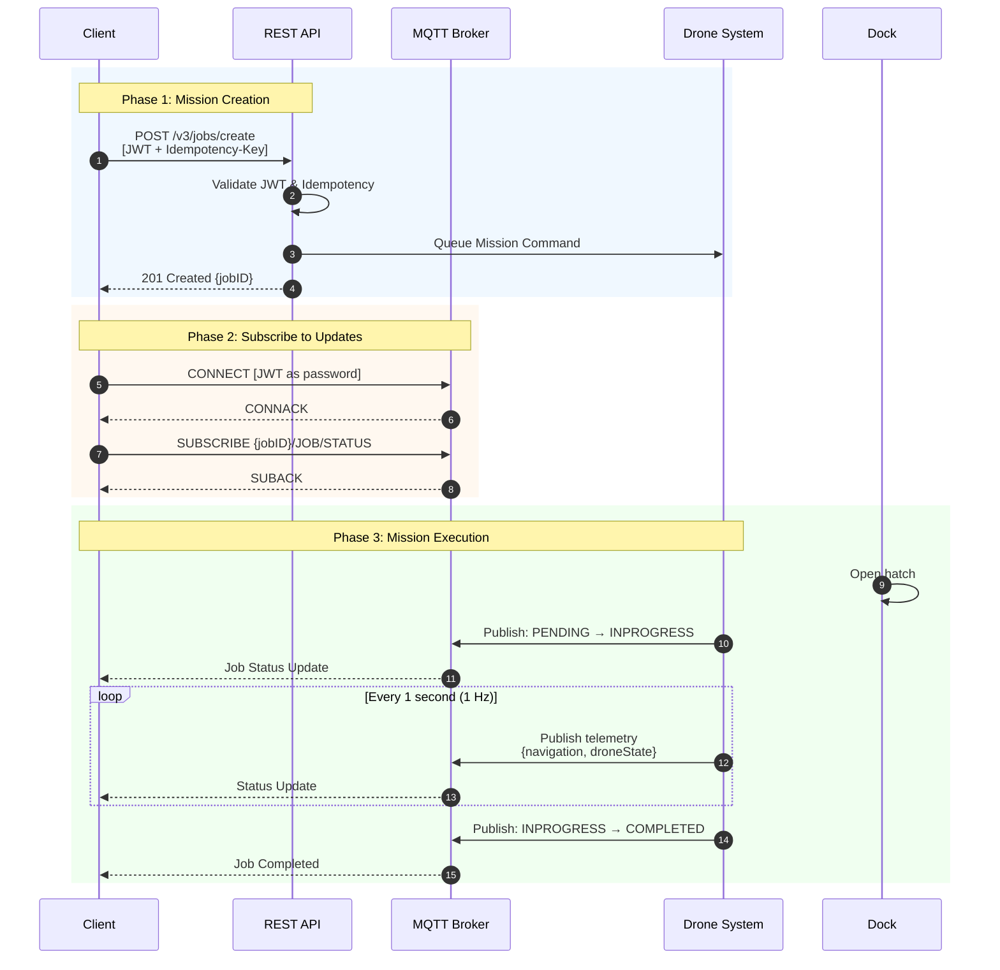
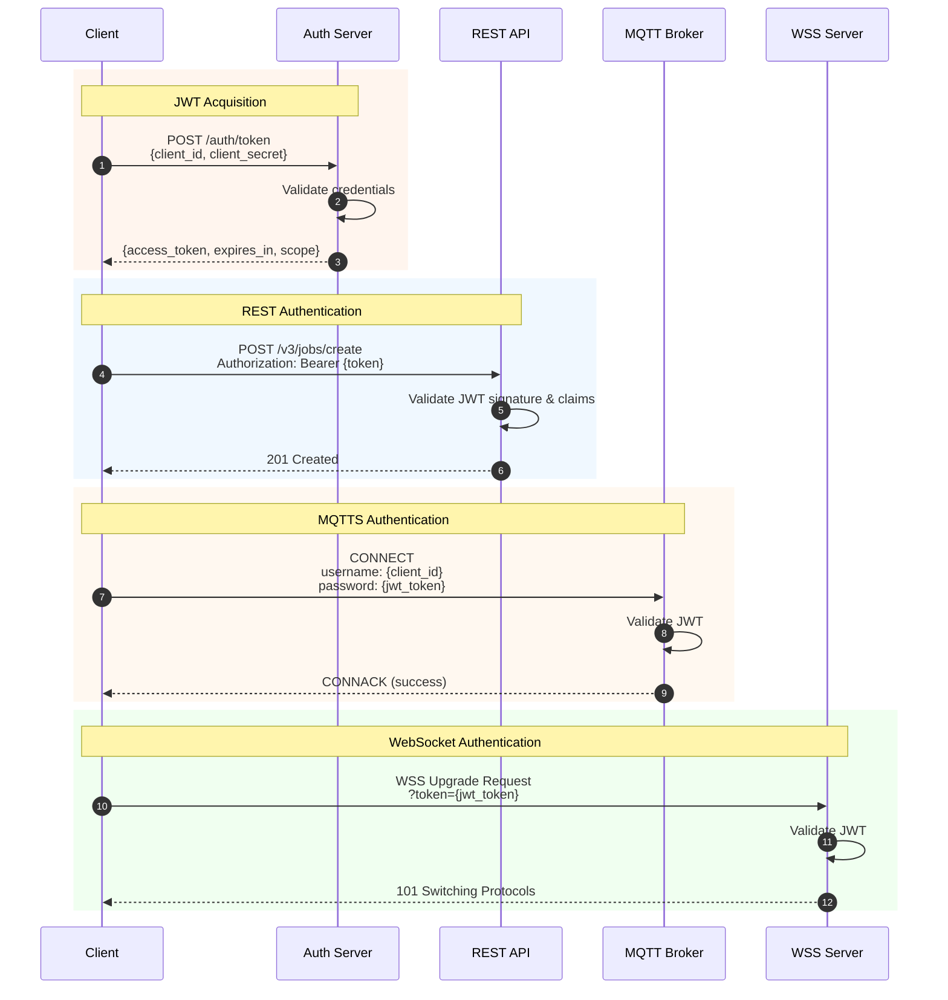
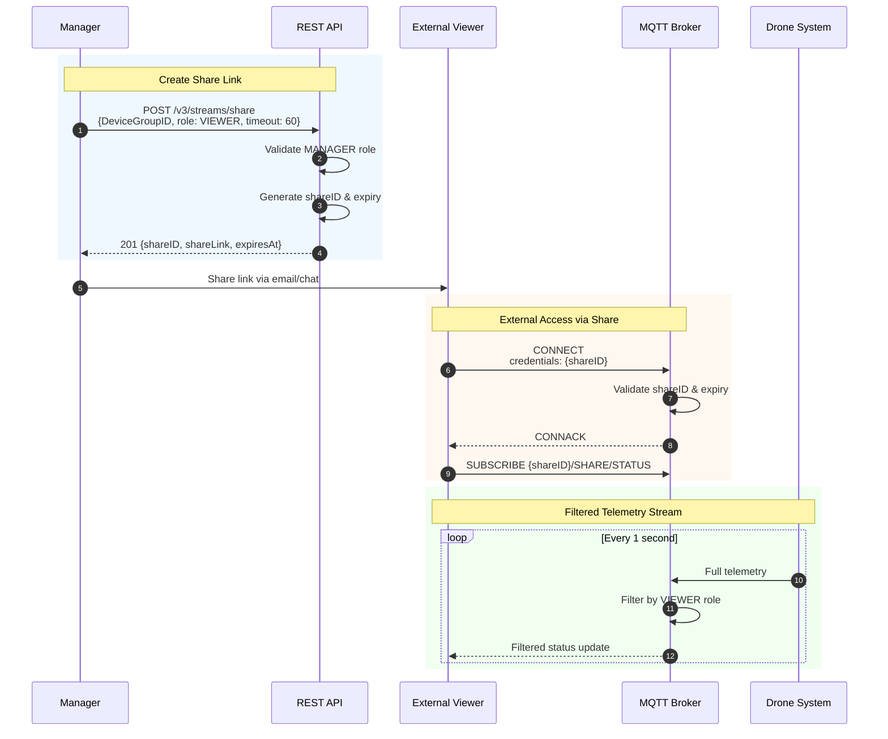
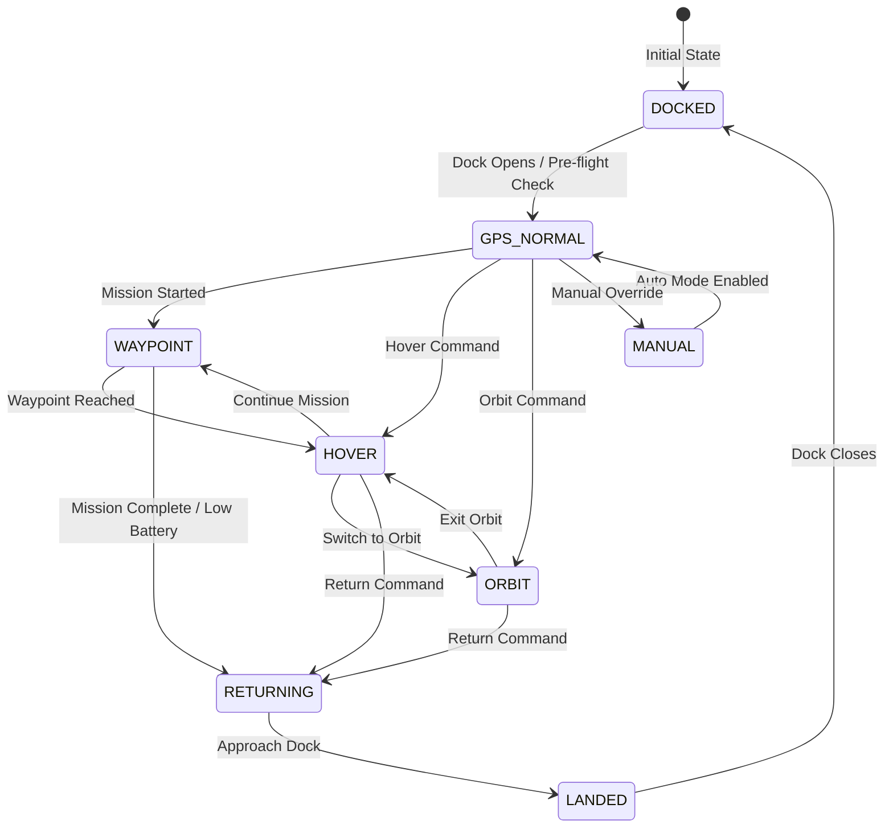
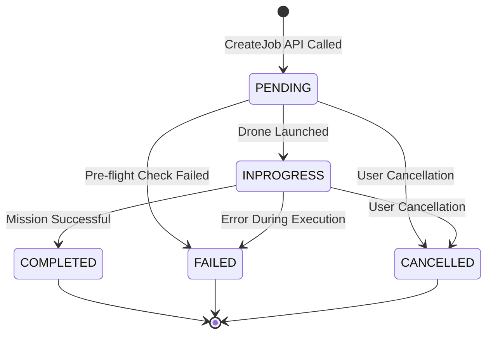
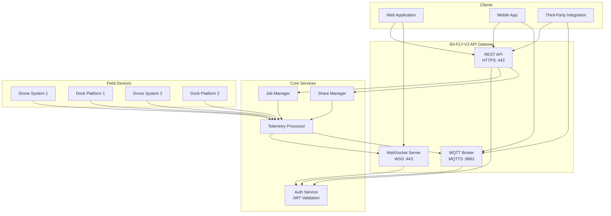

# IDI-FLY-V3 API Documentation

**Version:** v3 | **Status:** Production | **Updated:** 2025-11-27

Hybrid API for mission control, resource management, and real-time telemetry using HTTPS, MQTTS, and WSS.

---

## Sequence Diagrams

### Mission Flow



### Authentication Flow



### Stream Sharing Flow



### Drone State Transitions



### Job State Lifecycle



### System Architecture



---

## Base URLs

| Environment | REST | MQTTS | WSS |
|:------------|:-----|:------|:----|
| Production | `https://api.idi-fly.com/v3` | `mqtts://mqtt.idi-fly.com:8883` | `wss://ws.idi-fly.com/v3` |
| Staging | `https://api-staging.idi-fly.com/v3` | `mqtts://mqtt-staging.idi-fly.com:8883` | `wss://ws-staging.idi-fly.com/v3` |

---

## Authentication

**REST:** `Authorization: Bearer <token>`

**MQTTS:** Username: `<client_id>` / Password: `<jwt_token>`

**WSS:** `wss://ws.idi-fly.com/v3/jobs/{jobID}/status/ws?token=<jwt_token>`

---

## Endpoints

| # | Name | Method | Path/Topic | Protocol |
|:--|:-----|:-------|:-----------|:---------|
| 1 | CreateJob | POST | `/v3/jobs/create` | HTTPS |
| 2 | Track Job | SUB | `{jobID}/JOB/STATUS` | MQTTS |
| 3 | Track Job | CONNECT | `/v3/jobs/{jobID}/status/ws` | WSS |
| 4 | Track Resource | SUB | `{DeviceGroupID}/DEVICE/STATUS` | MQTTS |
| 5 | Track Resource | CONNECT | `/v3/devices/{DeviceGroupID}/status/ws` | WSS |
| 6 | Stream Share | POST | `/v3/streams/share` | HTTPS |
| 7 | Track Share | SUB | `{shareID}/SHARE/STATUS` | MQTTS |
| 8 | Track Share | CONNECT | `/v3/shares/{shareID}/status/ws` | WSS |
| 9 | Get Resources | GET | `/v3/shares/{sharecode}/resources` | HTTPS |

---

### 1. CreateJob

`POST /v3/jobs/create`

**Headers:** `Authorization: Bearer <token>`, `Idempotency-Key: <uuid>`

```json
{
  "DeviceGroupID": "b775cc6e-1234-5678-90ab-cdef12345678",
  "MissionID": "a1b2c3d4-5678-90ab-cdef-123456789012",
  "ActionOnArrival": "MISSION"
}
```

**Response (201):**
```json
{
  "jobID": "job-f47ac10b-58cc-4372-a567-0e02b2c3d479",
  "status": "PENDING",
  "createdAt": "2025-11-27T10:30:00Z"
}
```

---

### 2-3. Track Job Status

**MQTTS Topic:** `{jobID}/JOB/STATUS` | **WSS:** `/v3/jobs/{jobID}/status/ws`

```json
{
  "jobState": "INPROGRESS",
  "droneState": "WAYPOINT",
  "dockState": "OPEN",
  "navigation": {
    "position": { "type": "Point", "coordinates": [-122.4194, 37.7749, 85.5] },
    "orientation": { "heading": 270.5, "pitch": -2.1, "roll": 0.3 },
    "velocity": { "groundSpeed": 12.5, "verticalSpeed": -0.5 }
  },
  "timestamp": "2025-11-27T10:30:15.123Z"
}
```

---

### 4-5. Track Resource Status

**MQTTS Topic:** `{DeviceGroupID}/DEVICE/STATUS` | **WSS:** `/v3/devices/{DeviceGroupID}/status/ws`

```json
{
  "droneState": "GPS_NORMAL",
  "dockState": "CLOSED",
  "navigation": {
    "position": { "type": "Point", "coordinates": [-122.4194, 37.7749, 0] }
  },
  "weather": {
    "windSpeed": 5.2,
    "windDirection": 180,
    "temperature": 22.5,
    "humidity": 65,
    "rain": false
  },
  "timestamp": "2025-11-27T10:30:15.123Z"
}
```

---

### 6. Stream Share

`POST /v3/streams/share` (Requires MANAGER role)

```json
{
  "DeviceGroupID": "b775cc6e-1234-5678-90ab-cdef12345678",
  "role": "VIEWER",
  "timeout": 60
}
```

**Response (201):**
```json
{
  "shareID": "share-abc123def456",
  "shareLink": "https://app.idi-fly.com/shared/share-abc123def456",
  "expiresAt": "2025-11-27T11:30:00Z"
}
```

---

### 7-8. Track Share Status

**MQTTS Topic:** `{shareID}/SHARE/STATUS` | **WSS:** `/v3/shares/{shareID}/status/ws`

Uses `shareID` as credential. Payload filtered by role.

---

### 9. Get Resources

`GET /v3/shares/{sharecode}/resources`

```json
{
  "resources": ["drone-system-b775cc6e", "dock-platform-d99f01a3"]
}
```

---

## States

| Job | Drone | Dock |
|:----|:------|:-----|
| PENDING | MANUAL | OPEN |
| INPROGRESS | GPS_NORMAL | CLOSED |
| COMPLETED | WAYPOINT | OPENING |
| FAILED | HOVER | CLOSING |
| CANCELLED | ORBIT | COOLING |
| | LANDED | CHARGING |
| | DOCKED | TASK_INPROGRESS |
| | RETURNING | |

---

## Roles

| Role | Permissions |
|:-----|:------------|
| VIEWER | View telemetry and status |
| PILOT | VIEWER + Control missions |
| MANAGER | PILOT + Share streams, Manage resources |

---

## Rate Limits

| Endpoint | Limit |
|:---------|:------|
| POST /v3/jobs/create | 60/min |
| POST /v3/streams/share | 30/min |
| GET /v3/shares/{sharecode}/resources | 120/min |

**Connections:** MQTTS 100 subs/client | WSS 50 conn/client

---

## Error Codes

| Code | Status | Description |
|:-----|:-------|:------------|
| INVALID_TOKEN | 401 | JWT invalid or expired |
| INSUFFICIENT_PERMISSIONS | 403 | Missing required role |
| DEVICE_NOT_FOUND | 404 | DeviceGroupID not found |
| IDEMPOTENCY_CONFLICT | 409 | Duplicate key, different payload |
| DEVICE_OFFLINE | 503 | Device not online |

---

*IDI-FLY-V3 API v3.0.0*
